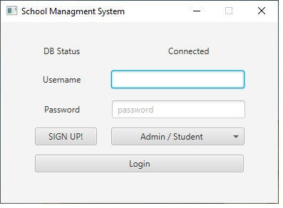
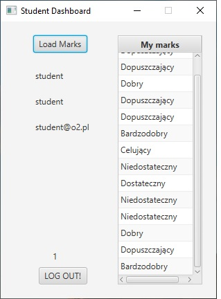
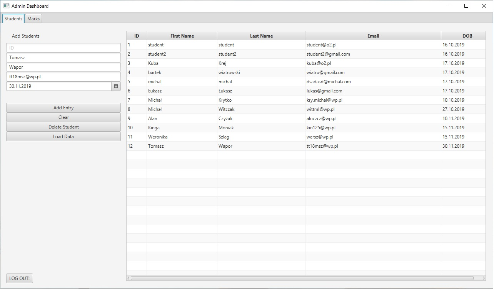
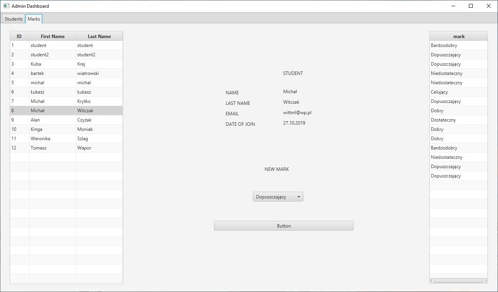
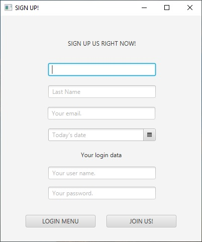

# schooldiary

## Table of contents
* [General info](#general-info)
* [Screenshots](#screenshots)
* [Technologies](#technologies)
* [Setup](#setup)
* [Features](#features)
* [Status](#status)
* [Inspiration](#inspiration)
* [Contact](#contact)

## General info
School diary is a desktop application. In the application, the teacher can add students to the diary and 
he can see all the information about students. The teacher can add grades to each student. 
Students can log in to their profile and check their grades.

## Technologies
* Java
* Javafx
* SQL
* SQLite

## Screenshots

Login Page.

Screen that student sees after logging in.

Screen that teacher sees after logging in.

Marks Screen on teacher profil.

Register Window.

